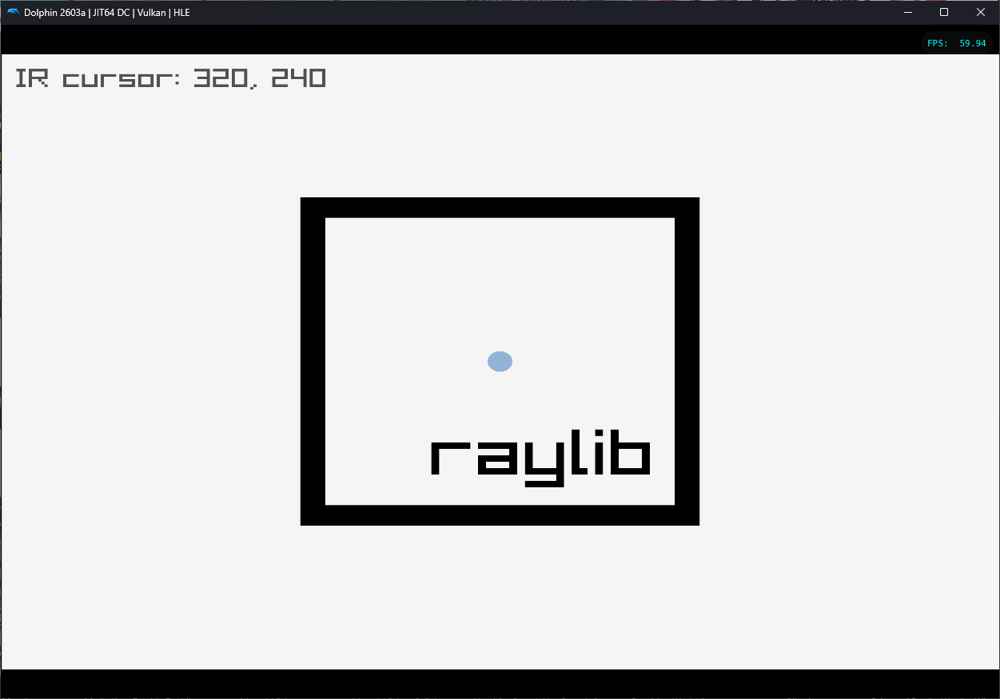
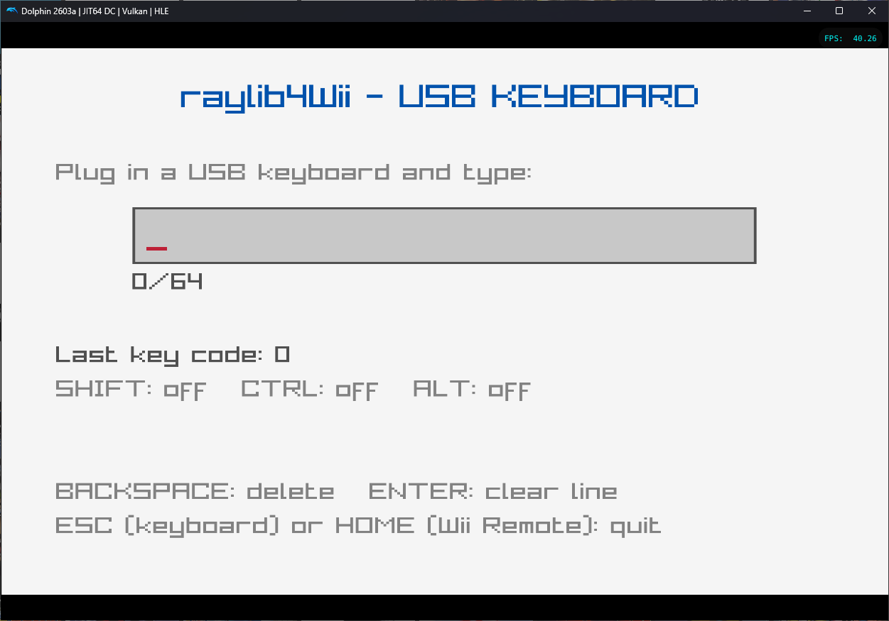
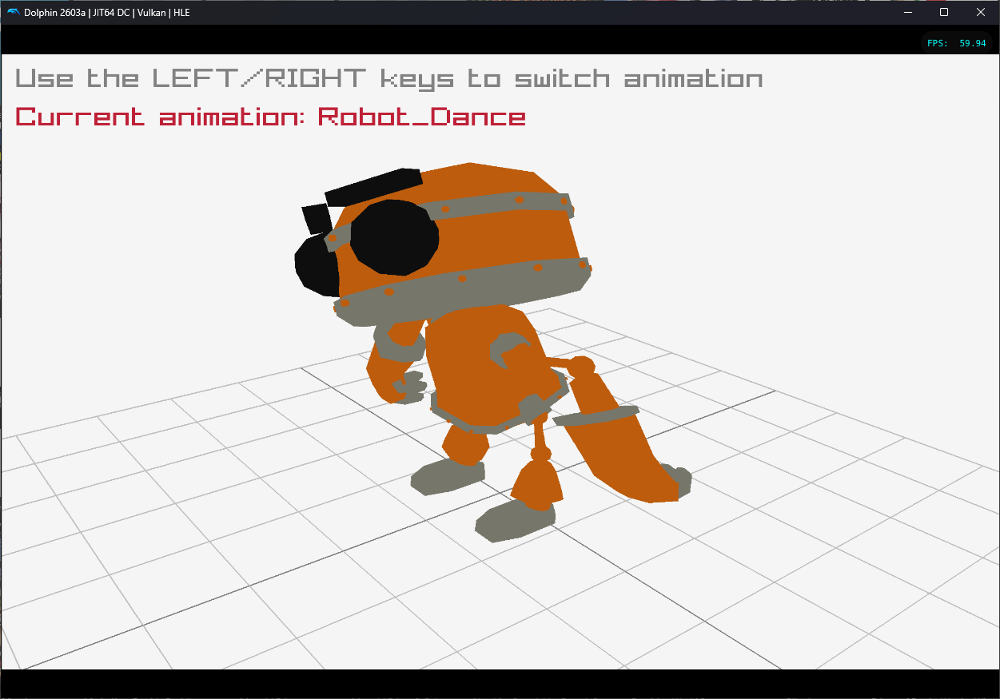
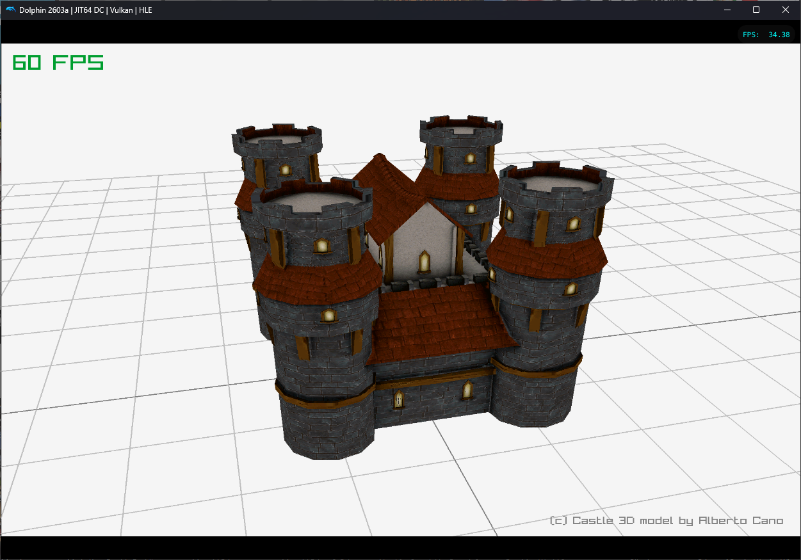
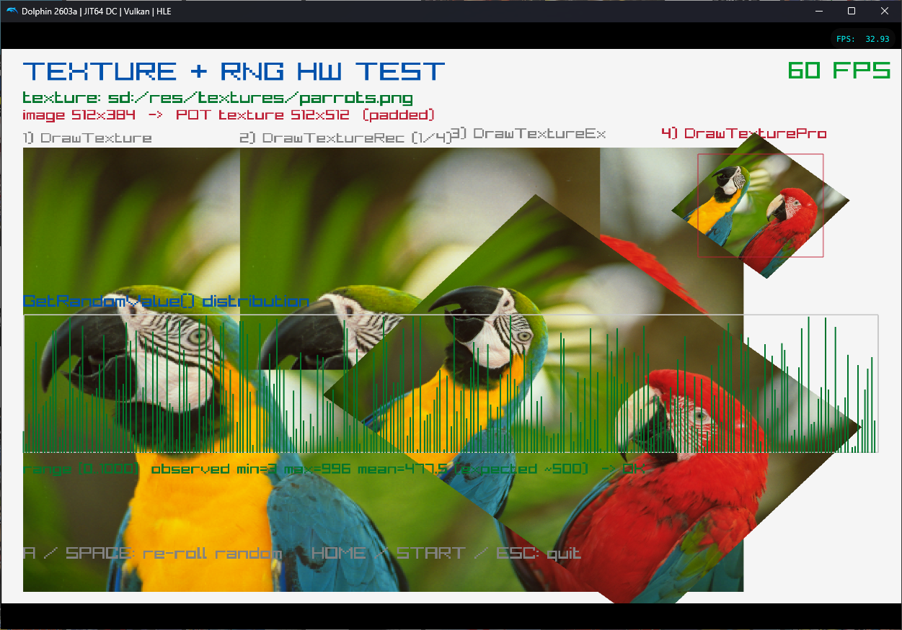

# raylib4Wii
raylib4Wii is a raylib port for Nintendo Wii


**raylib is a simple and easy-to-use library to enjoy videogames programming.**

raylib is highly inspired by Borland BGI graphics lib and by XNA framework and it's especially well suited for prototyping, tooling, graphical applications, embedded systems and education.

*NOTE for ADVENTURERS: raylib is a programming library to enjoy videogames programming; no fancy interface, no visual helpers, no debug button... just coding in the most pure spartan-programmers way.*

Ready to learn? Jump to [code examples!](https://www.raylib.com/examples.html)

---

## Installation

Install the latest devkitPro and add **libogc2**, following the steps from
[extremscorner/pacman-packages](https://github.com/extremscorner/pacman-packages#readme),
then clone the libogc2 fork:

```bash
pacman -S libogc2
pacman -S libogc2-opengx
```

### Prepare the raylib sources

raylib4Wii ships as a **patch** plus the Wii platform backend, applied on top of the
upstream raylib4Consoles 6.0 branch. A fresh raylib checkout needs two things added:

1. **Apply `raylib_wii.patch`** it adds `PLATFORM_WII` to the build system
   (`src/Makefile`, `src/rcore.c`, `src/rtext.c`), the big-endian fixes required for
   glTF loading on PowerPC (`src/rmodels.c`, `src/external/cgltf.h`), and the
   non-power-of-two texture handling (`src/rlgl.h`).
2. **Copy `src/platforms/rcore_wii.c`** into raylib's `src/platforms/` directory. This
   is the Wii window/input/graphics backend. The patch only references it via
   `#include "platforms/rcore_wii.c"` it does **not** contain the file itself, so it
   must be copied in separately.

Run from the raylib4Wii repo root:

```bash
# Clone the raylib4Consoles 6.0 branch into ./raylib
git clone https://github.com/raylib4Consoles/raylib -b raylib4Consoles_6.0

# Apply the Wii patch to the raylib checkout
git -C raylib apply ../raylib_wii.patch

# Copy the Wii platform backend into the raylib source tree
cp src/platforms/rcore_wii.c raylib/src/platforms/
```

> The patch paths are `a/src/... b/src/...`, so it must be applied from the raylib root
> (the directory that contains `src/`). If `git apply` reports errors, use `patch`
> instead: `cd raylib && patch -p1 < ../raylib_wii.patch`.

### Build and install raylib for the Wii

With the patch applied and `rcore_wii.c` copied in, build the static library and
install it into the libogc2 tree:

```bash
cd raylib/src
make PLATFORM=PLATFORM_WII
make install PLATFORM=PLATFORM_WII
```

This installs `libraylib.a` to `$(DEVKITPRO)/libogc2/wii/lib` and the headers to
`$(DEVKITPRO)/libogc2/wii/include`.

### Linking your application

raylib is a **static** library, so your application links against it together with
the libogc2 system libraries. The order matters each library depends on the ones
to its right, and getting it wrong is the most common cause of `undefined reference`
errors:

```
-lraylib -lopengx -lwiikeyboard -lwiiuse -lbte -lfat -logc -lm
```

- `opengx` – OpenGL 1.1 over GX
- `wiikeyboard` – USB keyboard input
- `wiiuse` + `bte` – Wii Remote (WPAD) + Bluetooth stack
- `fat` – SD card / storage access
- `logc` + `m` – libogc core and math

A minimal application `Makefile` based on the standard devkitPro template only needs
the include/library paths plus the `LIBS` line above:

```makefile
include $(DEVKITPRO)/libogc2/wii_rules

INCLUDE  := -I$(DEVKITPRO)/libogc2/wii/include
LIBPATHS := -L$(DEVKITPRO)/libogc2/wii/lib
LIBS     := -lraylib -lopengx -lwiikeyboard -lwiiuse -lbte -lfat -logc -lm
```

### Running

Build your project into a `.dol`, then run it either:

- on real hardware via the **Homebrew Channel** (copy the `.dol` to an SD card), or
- in the **Dolphin** emulator.

A USB Gecko (logs through `SYS_Report`) is useful for debugging on real hardware.

## Controls / Input mapping

Input is exposed through raylib's standard gamepad, mouse and keyboard API.
Wii Remotes are the primary controllers (gamepad slots 0–3); GameCube controllers
plugged into the console work as a fallback for any slot without a Wii Remote.

### Wii Remote

| Wii Remote                     | raylib gamepad button                                     |
| ------------------------------ | --------------------------------------------------------- |
| A                              | `GAMEPAD_BUTTON_RIGHT_FACE_DOWN`                          |
| B (trigger)                    | `GAMEPAD_BUTTON_RIGHT_FACE_LEFT`                          |
| 1                              | `GAMEPAD_BUTTON_RIGHT_FACE_RIGHT`                         |
| 2                              | `GAMEPAD_BUTTON_RIGHT_FACE_UP`                            |
| D-Pad Up / Down / Left / Right | `GAMEPAD_BUTTON_LEFT_FACE_UP` / `DOWN` / `LEFT` / `RIGHT` |
| PLUS (+)                       | `GAMEPAD_BUTTON_MIDDLE_RIGHT`                             |
| MINUS (−)                      | `GAMEPAD_BUTTON_MIDDLE_LEFT`                              |
| HOME                           | `GAMEPAD_BUTTON_MIDDLE`                                   |

> D-Pad directions assume the remote is held vertically (pointed at the screen).

The **IR pointer** is mapped onto the raylib **mouse**, so `GetMousePosition()`
returns where the remote points at the screen.

### Nunchuk

| Nunchuk      | raylib                                        |
| ------------ | --------------------------------------------- |
| Analog stick | `GAMEPAD_AXIS_LEFT_X` / `GAMEPAD_AXIS_LEFT_Y` |
| Z            | `GAMEPAD_BUTTON_LEFT_TRIGGER_1`               |
| C            | `GAMEPAD_BUTTON_LEFT_TRIGGER_2`               |

### GameCube controller

| GameCube                       | raylib gamepad button                                              |
| ------------------------------ | ------------------------------------------------------------------ |
| A                              | `GAMEPAD_BUTTON_RIGHT_FACE_DOWN`                                   |
| B                              | `GAMEPAD_BUTTON_RIGHT_FACE_LEFT`                                   |
| X                              | `GAMEPAD_BUTTON_RIGHT_FACE_RIGHT`                                  |
| Y                              | `GAMEPAD_BUTTON_RIGHT_FACE_UP`                                     |
| D-Pad Up / Down / Left / Right | `GAMEPAD_BUTTON_LEFT_FACE_UP` / `DOWN` / `LEFT` / `RIGHT`          |
| L / R                          | `GAMEPAD_BUTTON_LEFT_TRIGGER_1` / `GAMEPAD_BUTTON_RIGHT_TRIGGER_1` |
| START                          | `GAMEPAD_BUTTON_MIDDLE_RIGHT`                                      |
| Control stick / C-stick        | `GAMEPAD_AXIS_LEFT_X/Y` / `GAMEPAD_AXIS_RIGHT_X/Y`                 |
| L / R analog                   | `GAMEPAD_AXIS_LEFT_TRIGGER` / `GAMEPAD_AXIS_RIGHT_TRIGGER`         |

### Keyboard

A USB keyboard (via libwiikeyboard) is supported through raylib's keyboard API:
`IsKeyDown()`, `GetKeyPressed()`, `GetCharPressed()`.

### Samples

| Demo Screenshot  | Note   |
| --------------------------------- | --------------------------------------------------- |
|           | Shapes and Wiimote cursor test                      |
|  | USB keyboard demo                                   |
|         | GLTF model and animation loading test               |
|        | OBJ model loading test                              |
|  | Texture loading, drawing functions and random value test |

## Limitations

- **Non-power-of-two textures** are handled automatically. GX's `REPEAT`/`MIRROR`
  texture wrap modes only work with power-of-two textures (they address texels with
  a power-of-two bitmask), so a NPOT texture with `REPEAT` renders sheared on real
  hardware (it looks fine in the Dolphin emulator). raylib therefore sets
  `CLAMP_TO_EDGE` automatically for NPOT textures on the Wii/GameCube no quality
  loss. The only consequence: a NPOT texture cannot tile/repeat (UVs outside 0..1),
  which GX cannot do for NPOT anyway. Use power-of-two sizes if you need wrapping.
- **Binary model formats other than glTF** (IQM, M3D) are not yet byte-swapped for
  the big-endian PowerPC CPU, so they may load incorrectly. glTF (`.gltf`/`.glb`)
  is handled.

#  Credits
 - [@raysan5](https://www.github.com/raysan5) for his amazing work with raylib and raylib has an incredible community developing in the open way!!!! 
 - [@extremscorner](https://www.github.com/extremscorner) for libogc2
 - [@psxdev](https://www.github.com/psxdev) for raylib4Gamecube
 - all people involved in homebrew tools and libraries for Gamecube and Wii.
 - the community around raylib4Consoles

 
  License
===========================

raylib is licensed under an unmodified zlib/libpng license, which is an OSI-certified, BSD-like license that allows static linking with closed source software. Check [LICENSE](LICENSE) for further details.
